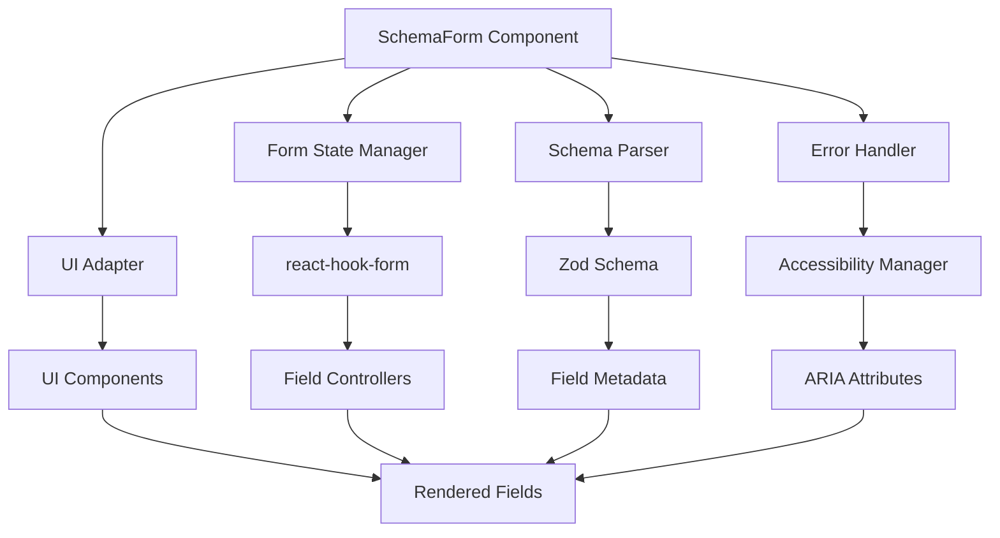

# Design Document

## Overview

SchemaForm is a React form library that automatically generates forms from Zod schemas using an adapter pattern architecture. The library leverages react-hook-form as its core engine for state management and validation, while providing a flexible UI adapter system that allows developers to use different UI libraries (MUI, Ant Design, etc.) or create custom components.

The design follows a clear separation of concerns: Zod schemas define data structure and validation rules, react-hook-form manages form state and performance, UI adapters handle rendering, and SchemaForm orchestrates the entire process.

## Architecture

### Core Components



### Data Flow

1. **Schema Processing**: SchemaForm receives a Zod schema and extracts field definitions, types, and metadata
2. **Form Initialization**: Creates react-hook-form instance with zodResolver for validation
3. **Field Rendering**: For each field, determines component type and renders using UI adapter
4. **State Management**: react-hook-form manages field values, validation state, and form submission
5. **Error Handling**: Validation errors are captured and displayed with accessibility support
6. **User Interaction**: Field changes trigger validation based on configured mode (onChange, onBlur, onSubmit)

## Components and Interfaces

### SchemaForm Component

The main orchestrator component that accepts a schema and configuration, then renders the complete form.

```typescript
interface SchemaFormProps<T extends ZodType> {
  // Core props
  schema: T;
  onSubmit: (data: z.output<T>) => void | Promise<void>;
  uiAdapter: UIAdapter;
  
  // Form configuration
  defaultValues?: DeepPartial<z.output<T>>;
  mode?: 'onChange' | 'onBlur' | 'onSubmit' | 'onTouched' | 'all';
  
  // Controlled mode
  control?: Control<z.output<T>>;
  
  // Customization
  renderFieldLayout?: RenderFieldLayout;
  
  // Error handling
  errorMessages?: ErrorMessages;
  errorDisplayOptions?: ErrorDisplayOptions;
  onError?: (errors: FormErrorState) => void;
  
  // Accessibility
  formAriaLabel?: string;
  formAriaDescribedBy?: string;
  
  // Advanced features
  validateOnMount?: boolean;
  resetOnSubmit?: boolean;
  
  // Form control refs
  formRef?: React.RefObject<SchemaFormRef>;
}

interface SchemaFormRef {
  // Form control methods
  reset: (values?: DeepPartial<z.output<T>>) => void;
  clear: () => void;
  
  // Validation methods
  validate: () => Promise<boolean>;
  validateField: (fieldName: string) => Promise<boolean>;
  
  // Form state access
  getValues: () => z.output<T>;
  getValue: (fieldName: string) => any;
  setValue: (fieldName: string, value: any) => void;
  
  // Error management
  setError: (fieldName: string, error: FieldError) => void;
  clearError: (fieldName: string) => void;
  clearAllErrors: () => void;
  
  // Form submission
  submit: () => void;
  
  // Focus management
  focusField: (fieldName: string) => void;
}
```

### UI Adapter Interface

Defines the contract for rendering different field types and layouts.

```typescript
interface UIAdapter {
  // Core field rendering
  renderField: (
    componentType: StandardComponentType | string,
    props: FieldProps
  ) => ReactNode;
  
  // Custom component support
  renderCustomComponent?: (
    Component: React.ComponentType<any>,
    props: FieldProps
  ) => ReactNode;
  
  // Layout customization
  renderFieldLayout?: RenderFieldLayout;
  
  // Form-level rendering
  renderFormContainer?: (children: ReactNode, props: FormContainerProps) => ReactNode;
  
  // Error display customization
  renderErrorMessage?: (error: FieldError, fieldName: string) => ReactNode;
}
```

### Field Props Interface

Standardized props passed to all field components.

```typescript
interface FieldProps {
  // react-hook-form integration
  name: string;
  control: Control<any>;
  
  // Field metadata from schema
  label?: string;
  placeholder?: string;
  helperText?: string;
  required?: boolean;
  disabled?: boolean;
  
  // Validation and errors
  error?: FieldError;
  isValidating?: boolean;
  
  // Field-specific data
  options?: Array<{ value: string; label: string }>;
  meta?: FieldMetadata;
  
  // Accessibility
  ariaLabel?: string;
  ariaDescribedBy?: string;
  
  // Event handlers
  onFocus?: (event: FocusEvent) => void;
  onBlur?: (event: FocusEvent) => void;
  onChange?: (value: any) => void;
}
```

### Field Metadata Interface

Extended metadata that can be attached to schema fields via .meta().

```typescript
interface FieldMetadata {
  // Basic UI metadata
  label: string;
  placeholder?: string;
  helperText?: string;
  
  // Component specification
  componentType?: StandardComponentType | string;
  component?: React.ComponentType<FieldProps>;
  
  // Validation behavior
  validationTrigger?: 'onChange' | 'onBlur' | 'onSubmit';
  
  // Conditional rendering
  displayCondition?: (formValues: any) => boolean;
  disabledCondition?: (formValues: any) => boolean;
  
  // Accessibility
  ariaLabel?: string;
  ariaDescribedBy?: string;
  
  // Error handling
  errorMessage?: string | ((error: FieldError) => string);
  showErrorOnTouch?: boolean;
  clearErrorOnFocus?: boolean;
  
  // Custom properties
  [key: string]: any;
}
```

## Data Models

### Schema Processing

The library processes Zod schemas to extract field information:

```typescript
interface FormField {
  path: string;           // Field path (e.g., "user.email")
  zodType: ZodType;       // Original Zod type
  meta: FieldMetadata;    // Extracted metadata
  isOptional: boolean;    // Whether field is optional
  defaultValue?: any;     // Default value if specified
}
```

### Error State Management

Enhanced error handling with granular control:

```typescript
interface FormErrorState {
  [fieldPath: string]: {
    hasError: boolean;
    error?: FieldError;
    isDirty: boolean;
    isTouched: boolean;
    isValidating: boolean;
  };
}

interface ErrorDisplayOptions {
  showErrorsOnTouch?: boolean;
  showErrorsOnSubmit?: boolean;
  showErrorsOnBlur?: boolean;
  showErrorsOnChange?: boolean;
  clearErrorsOnFocus?: boolean;
  errorDisplayDelay?: number;
  groupErrors?: boolean;
}
```

### Async Validation State

Tracking asynchronous validation operations:

```typescript
interface AsyncValidationState {
  validatingFields: Set<string>;
  validationPromises: Map<string, Promise<boolean>>;
  validationResults: Map<string, ValidationResult>;
}

interface ValidationResult {
  isValid: boolean;
  error?: string;
  timestamp: number;
}
```

## Error Handling

### Validation Pipeline

1. **Schema Validation**: Zod schema validates field values and structure
2. **Custom Validation**: Additional validation functions can be attached to fields
3. **Async Validation**: Server-side validation for complex business rules
4. **Cross-Field Validation**: Validation that depends on multiple field values

### Error Display Strategy

```typescript
class ErrorManager {
  private errorState: FormErrorState = {};
  private displayOptions: ErrorDisplayOptions;
  
  shouldShowError(fieldPath: string, meta: FieldMetadata, isSubmitted: boolean): boolean {
    const fieldError = this.errorState[fieldPath];
    if (!fieldError?.hasError) return false;
    
    // Check display conditions based on configuration
    if (this.displayOptions.showErrorsOnSubmit && isSubmitted) return true;
    if (this.displayOptions.showErrorsOnTouch && fieldError.isTouched) return true;
    if (this.displayOptions.showErrorsOnBlur && fieldError.isDirty) return true;
    
    // Field-level overrides
    if (meta.showErrorOnTouch && fieldError.isTouched) return true;
    
    return false;
  }
  
  formatErrorMessage(error: FieldError, fieldName: string, meta: FieldMetadata): string {
    if (meta.errorMessage) {
      return typeof meta.errorMessage === 'function' 
        ? meta.errorMessage(error) 
        : meta.errorMessage;
    }
    return error.message || `Invalid value for ${fieldName}`;
  }
}
```

### Accessibility Integration

Error handling includes comprehensive accessibility support:

```typescript
interface AccessibilityManager {
  announceError(fieldName: string, errorMessage: string): void;
  clearErrorAnnouncement(fieldName: string): void;
  setFieldAriaInvalid(fieldName: string, isInvalid: boolean): void;
  associateErrorWithField(fieldName: string, errorId: string): void;
}
```

## Testing Strategy

### Unit Testing

- **Schema Processing**: Test field extraction from various Zod schema types
- **Component Rendering**: Test that correct components are rendered for each field type
- **Validation Logic**: Test validation triggers and error display conditions
- **Accessibility**: Test ARIA attributes and screen reader announcements

### Integration Testing

- **Form Submission**: Test complete form submission flow with validation
- **Conditional Fields**: Test dynamic field showing/hiding based on form values
- **Async Validation**: Test server-side validation with loading states
- **UI Adapter Integration**: Test different UI adapters render correctly

### E2E Testing

- **User Interactions**: Test complete user workflows from form entry to submission
- **Error Recovery**: Test user can recover from validation errors
- **Accessibility Navigation**: Test keyboard navigation and screen reader usage
- **Performance**: Test form performance with large schemas and many fields

### Testing Utilities

```typescript
// Test utilities for schema form testing
export const createTestSchema = (fields: Record<string, ZodType>) => {
  return z.object(fields);
};

export const createMockAdapter = (): UIAdapter => ({
  renderField: jest.fn((type, props) => <div data-testid={`field-${props.name}`} />),
  renderCustomComponent: jest.fn(),
  renderFieldLayout: jest.fn(),
});

export const renderSchemaForm = (schema: ZodType, options?: Partial<SchemaFormProps>) => {
  return render(
    <SchemaForm
      schema={schema}
      uiAdapter={createMockAdapter()}
      onSubmit={jest.fn()}
      {...options}
    />
  );
};
```

## Performance Considerations

### Optimization Strategies

1. **Memoization**: Memoize field components to prevent unnecessary re-renders
2. **Lazy Loading**: Load complex components only when needed
3. **Virtual Scrolling**: For forms with many fields, implement virtual scrolling
4. **Debounced Validation**: Debounce validation for onChange mode to reduce API calls

### Memory Management

```typescript
// Cleanup strategies for large forms
class FormCleanupManager {
  private validationTimeouts: Map<string, NodeJS.Timeout> = new Map();
  private asyncValidationControllers: Map<string, AbortController> = new Map();
  
  cleanup(): void {
    // Clear validation timeouts
    this.validationTimeouts.forEach(timeout => clearTimeout(timeout));
    this.validationTimeouts.clear();
    
    // Abort pending async validations
    this.asyncValidationControllers.forEach(controller => controller.abort());
    this.asyncValidationControllers.clear();
  }
}
```

## Security Considerations

### Input Sanitization

- All user input is validated through Zod schemas before processing
- XSS prevention through proper React rendering and prop sanitization
- SQL injection prevention through parameterized queries in async validation

### Data Privacy

- Sensitive field values (passwords) are not logged or stored in development tools
- Form data is cleared from memory after submission
- Validation errors don't expose sensitive system information

## Extensibility

### Custom Adapters

Developers can create custom UI adapters by implementing the UIAdapter interface:

```typescript
const MyCustomAdapter: UIAdapter = {
  renderField: (componentType, props) => {
    switch (componentType) {
      case 'text':
        return <MyTextInput {...props} />;
      case 'select':
        return <MySelectInput {...props} />;
      default:
        return <div>Unsupported type: {componentType}</div>;
    }
  },
  
  renderFieldLayout: (field, label, error) => (
    <div className="my-field-layout">
      <label>{label}</label>
      {field}
      {error && <span className="error">{error.message}</span>}
    </div>
  ),
};
```

### Plugin System

Future extensibility through a plugin system:

```typescript
interface SchemaFormPlugin {
  name: string;
  version: string;
  install: (schemaForm: SchemaFormInstance) => void;
  uninstall?: (schemaForm: SchemaFormInstance) => void;
}

// Example plugin for form analytics
const AnalyticsPlugin: SchemaFormPlugin = {
  name: 'analytics',
  version: '1.0.0',
  install: (schemaForm) => {
    schemaForm.on('fieldChange', (fieldName, value) => {
      analytics.track('form_field_changed', { fieldName, value });
    });
    schemaForm.on('formSubmit', (data) => {
      analytics.track('form_submitted', { formId: schemaForm.id });
    });
  },
};
```

This design provides a solid foundation for implementing all the requirements while maintaining flexibility, performance, and accessibility standards.