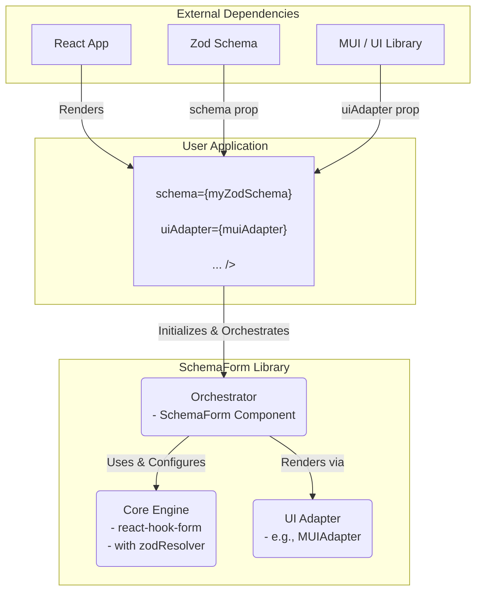

# SchemaForm 라이브러리 아키텍처 (v0.13)

## 1. 개요 (Overview)

본 문서는 PRD(prd_form_library_draft_v1)에 정의된 요구사항을 충족시키기 위한 SchemaForm 라이브러리의 기술 아키텍처를 설명합니다. 라이브러리의 핵심 원칙, 주요 컴포넌트의 역할과 책임, 컴포넌트 간 상호작용 및 데이터 흐름을 정의하는 것을 목표로 합니다.

## 2. 핵심 설계 원칙 (Core Design Principles)

- **관심사의 분리 (Separation of Concerns):** 폼의 '상태 및 로직'(State & Logic), '데이터 구조 및 유효성 검증'(Schema & Validation), '표현'(UI/View)을 명확하게 분리합니다.
- **스키마 표준화 (Schema Standardization):** `zod`를 표준 스키마로 채택하여 데이터 구조와 유효성 검증 규칙을 선언적으로 관리합니다.
- **높은 UI 확장성 (High UI Extensibility):** 어댑터 패턴을 통해 UI 라이브러리를 쉽게 교체하거나 추가할 수 있어야 합니다.
- **최고의 개발자 경험 (Developer Experience First):** 타입 안정성, 명확한 API, 상세한 문서를 통해 개발자가 라이브러리를 쉽고 즐겁게 사용할 수 있도록 합니다.
- **성능 최적화 (Performance Optimization):** `react-hook-form`의 강점을 최대한 활용하여 불필요한 리렌더링을 최소화하고 빠른 응답성을 보장합니다.

## 3. 시스템 아키텍처 다이어그램 (System Architecture Diagram)



## 4. 주요 컴포넌트 상세 (Detailed Component Breakdown)

### 4.1. Core Engine (`react-hook-form` 기반)

- **역할:** 폼의 상태 관리를 전담하는 핵심 엔진.
- **책임:**
  - `useForm` 훅을 통해 폼의 상태(값, 에러, `dirty`, `touched` 등)를 관리합니다.
  - `zod` 스키마로부터 생성된 `resolver`를 사용하여 유효성 검사를 수행합니다.
  - 필드 등록(`register`), 렌더링 제어(`Controller`) 등 `react-hook-form`의 API를 내부적으로 사용하여 UI와 상태를 연결합니다.
  - 폼 제출(`handleSubmit`) 로직을 처리합니다.

### 4.2. `<SchemaForm>` 컴포넌트

- **역할:** 라이브러리의 메인 진입점이자 전체 플로우를 조율하는 오케스트레이터.
- **책임:**
  - 사용자로부터 `schema`, `uiAdapter`, `onSubmit` 등의 `props`를 전달받습니다.
  - `useForm` 훅을 초기화하고, `control`, `formState` 등의 `react-hook-form` 인스턴스를 내부적으로 관리합니다.
  - 스키마 객체를 순회하며 각 필드에 대한 렌더링을 `UIAdapter`에 위임합니다.
  - 렌더링된 필드에 `react-hook-form`의 `<Controller>`를 통해 필요한 `props`(e.g., `onChange`, `onBlur`, `value`, `ref`)를 주입합니다.

#### 4.2.1. 에러 및 비동기 처리 상세 흐름

- **에러 처리 흐름:**
    1. `<SchemaForm>`은 `useForm` 훅의 `formState`에서 `errors` 객체를 구독합니다.
    2. 필드 렌더링 루프에서, 현재 렌더링할 필드의 `name`(예: `"user.email"`)을 키(key)로 사용하여 `errors` 객체에서 해당 필드의 에러 정보를 조회합니다. (LODASH의 `get`과 유사한 유틸리티 사용)
    3. 조회된 에러 객체가 존재하면, `error.message`를 추출합니다.
    4. 추출된 `errorMessage`를 `FormFieldLayout` 컴포넌트(또는 커스텀 `renderFieldLayout` 함수)에 `error` prop으로 전달하여 UI에 렌더링합니다.

- **비동기 검증 처리 흐름 :**
    1. `<SchemaForm>`은 `formState.isValidating` 상태(폼 전체의 유효성 검사 진행 여부)를 구독합니다.
    2. **동시 다중 필드 검증 지원:** 필드별 비동기 검증 상태를 추적하기 위해, `<SchemaForm>`은 내부적으로 `validatingFields: Set<string>` 상태를 관리합니다.
    3. 필드의 비동기 검증이 시작되면 해당 필드의 `name`을 `validatingFields` Set에 추가합니다.
    4. 필드 렌더링 루프에서, 현재 필드의 `name`이 `validatingFields` Set에 포함되어 있는지 여부로 '검증 중' 상태를 판단하고, 이 상태(`isValidating` prop)를 `FormFieldLayout`에 전달하여 필드별 로딩 UI를 표시합니다.
    5. **상태 정리(Cleanup):** 필드의 비동기 검증이 완료되면(성공 또는 실패), 해당 필드의 `name`을 `validatingFields` Set에서 제거합니다. 또한, `formState.isValidating`이 `true`에서 `false`로 변경되는 시점을 `useEffect`로 감지하여, 모든 검증이 완료되었음을 확인하고 `validatingFields` Set을 비우는 정리 로직을 수행하여 상태 불일치를 방지합니다.

### 4.3. UI 어댑터 (UI Adapter)

- **패턴 및 역할:** UI 어댑터는 **어댑터 패턴(Adapter Pattern)**을 활용하여 `SchemaForm`의 핵심 렌더링 로직과 실제 UI 구현체(디자인 시스템) 사이의 '다리' 역할을 수행합니다. 이 설계의 핵심 목표는 **관심사의 분리**를 극대화하는 것입니다. 즉, "어떤 데이터를 어떻게 렌더링할지"에 대한 결정은 `SchemaForm`이 하고, "그것을 화면에 어떻게 그릴지"에 대한 구체적인 방법은 UI 어댑터에게 위임합니다.

    이를 통해 `SchemaForm`은 MUI, Ant Design, Chakra UI 등 특정 UI 라이브러리에 대한 종속성 없이 독립적으로 존재할 수 있습니다. 개발자는 프로젝트의 기술 스택이나 디자인 시스템에 맞는 어댑터만 제공하면, 동일한 스키마와 로직을 재사용하여 완전히 다른 모습의 폼을 렌더링할 수 있습니다. 이런 관점에서 각 UI 어댑터는 폼을 렌더링하기 위한 일종의 교체 가능한 **전략(Strategy)**으로 볼 수도 있습니다.

- **동작 원리:**
    1. `<SchemaForm>`은 스키마를 순회하며 각 필드의 타입(`string`, `boolean` 등)과 메타데이터(`componentType: 'password'`)를 확인합니다.
    2. 이 정보를 `key`로 사용하여 `props`로 전달된 `uiAdapter` 객체에서 렌더링을 담당할 React 컴포넌트를 찾습니다.
    3. 찾아낸 컴포넌트에게 `react-hook-form`의 상태(`field`, `formState`)와 스키마 메타데이터(`label`, `placeholder` 등)를 `props`로 전달하여 렌더링을 위임합니다.

- **인터페이스 (계약):** UI 어댑터와 그 안의 컴포넌트들은 `SchemaForm`과 명확한 `props` 계약을 따릅니다.

    ```typescript
    import { ControllerRenderProps, FormState, FieldValues } from 'react-hook-form';

    // UI 어댑터의 기본 구조: 필드 타입을 키로, React 컴포넌트를 값으로 가집니다.
    interface UIAdapter {
      [fieldType: string]: React.ComponentType<FieldProps>;
    }

    // 모든 UI 어댑터 내 컴포넌트가 받아야 하는 표준 props 인터페이스
    interface FieldProps {
      // react-hook-form이 제공하는 필드 제어 props (onChange, onBlur, value 등)
      field: ControllerRenderProps<FieldValues, string>; 
      // 폼의 전반적인 상태 (errors, isValidating 등)
      formState: FormState<FieldValues>;
      // 스키마의 meta()에서 추출된 UI 관련 정보
      label: string;
      placeholder?: string;
      helperText?: string;
    }
    ```

- **구현체 예시 (MUIAdapter):**

    ```typescript
    // packages/adapter-mui/src/index.ts
    import { TextField, Checkbox, FormControlLabel } from '@mui/material';

    export const muiAdapter: UIAdapter = {
      string: ({ field, formState, label, placeholder }) => (
        <TextField
          {...field}
          label={label}
          placeholder={placeholder}
          error={!!formState.errors[field.name]}
          helperText={formState.errors[field.name]?.message as string}
        />
      ),
      boolean: ({ field, label }) => (
        <FormControlLabel
          control={<Checkbox {...field} checked={field.value} />}
          label={label}
        />
      ),
      // 'password' 타입에 대한 별도 컴포넌트 정의
      password: ({ field, formState, label }) => (
        <TextField
          {...field}
          type="password"
          label={label}
          error={!!formState.errors[field.name]}
        />
      ),
      // ... 다른 타입들에 대한 컴포넌트들
    };
    ```

## 5. 데이터 및 제어 흐름 (Data & Control Flow)

1. **초기화 (Initialization):**
    사용자가 `<SchemaForm>`을 렌더링하면, 컴포넌트는 전달받은 `zod` 스키마를 `@hookform/resolvers/zod`를 통해 `resolver`로 변환하고, 이를 사용하여 `useForm` 훅을 초기화합니다.
2. **렌더링 (Rendering):**
    `<SchemaForm>`은 스키마를 순회하며 각 필드를 `react-hook-form`의 `<Controller>`로 감쌉니다. `<Controller>`의 `render` prop 내에서 `UIAdapter`를 호출하여 실제 UI 컴포넌트를 렌더링하고 `field`와 `formState`를 전달합니다.
3. **상호작용 및 유효성 검사 (Interaction & Validation):**
    사용자 입력 시 `onChange`가 트리거되어 `react-hook-form`의 상태가 업데이트됩니다. 상태 변경에 따라 `resolver`를 통한 유효성 검사가 자동으로 수행되고, `formState.errors`가 업데이트됩니다.
4. **제출 (Submission):**
    제출 시 `react-hook-form`의 `handleSubmit`이 최종 유효성 검사를 수행합니다. 성공 시 사용자에게 받은 `onSubmit` 콜백이 데이터와 함께 호출됩니다.

## 6. API 설계 (초안)

### 6.1. 비제어(Uncontrolled) 모드 (기본)

```tsx
import { SchemaForm } from 'schema-form';
import { muiAdapter } from 'schema-form/adapters/mui';
import { z } from 'zod';

const mySchema = z.object({
  name: z.string().min(2, '이름은 두 글자 이상이어야 합니다.'),
  email: z.string().email(),
});

function MyComponent() {
  const handleSubmit = (data) => {
    console.log(data); // { name: '...', email: '...' }
  };

  return (
    <SchemaForm
      schema={mySchema}
      uiAdapter={muiAdapter}
      onSubmit={handleSubmit}
    />
  );
}
```

### 6.2. 제어(Controlled) 모드

```tsx
import { useForm } from 'react-hook-form';
import { zodResolver } from '@hookform/resolvers/zod';
// ... other imports

function MyAdvancedComponent() {
  const { control, handleSubmit, formState, watch } = useForm({
    resolver: zodResolver(mySchema),
    defaultValues: { name: '기본값', email: '' },
  });

  const currentName = watch('name');

  const onSubmit = (data) => {
    console.log(data);
  };

  return (
    <>
      <p>현재 이름: {currentName}</p>
      <SchemaForm
        control={control} // 외부에서 생성한 control 객체 주입
        uiAdapter={muiAdapter}
        schema={mySchema} // 렌더링을 위해 스키마는 여전히 필요
        onSubmit={handleSubmit(onSubmit)} // handleSubmit으로 감싸서 전달
      />
    </>
  );
}
```

### 6.3. 제어 및 비제어 모드 심층 분석

- **`control` prop 존재 여부에 따른 동작 분기:**
    `<SchemaForm>` 컴포넌트는 내부적으로 `control` prop의 존재 여부를 확인합니다.
  - **`control` prop이 없으면 (비제어 모드):** 컴포넌트 내부에서 `useForm` 훅을 호출하여 자체적인 폼 상태를 생성하고 관리합니다.
  - **`control` prop이 있으면 (제어 모드):** 컴포넌트는 내부 `useForm` 초기화 로직을 완전히 건너뜁니다. 대신, 외부에서 주입된 `control` 객체를 그대로 사용하여 필드를 렌더링합니다. 이는 `react-hook-form` 인스턴스의 중복 생성을 막고, 폼의 상태 관리가 오직 외부 한 곳에서만 이루어지도록 보장하여 상태 불일치 문제를 원천적으로 방지합니다.

- **`defaultValues` 처리 우선순위 및 동기화:**
  - **정책:** 제어 모드에서 `defaultValues`의 우선순위는 전적으로 외부 `useForm`에 있습니다. `<SchemaForm>`은 스키마로부터 초기값을 추론하거나 주입하려 시도하지 않습니다.
  - **초기값 설정:** 사용자는 제어 모드를 사용할 때 `useForm`의 `defaultValues` 옵션을 통해 폼의 초기값을 명시적으로 설정해야 합니다.
  - **동적 값 동기화:** 만약 비동기적으로 `defaultValues`를 업데이트해야 한다면, 사용자는 외부 `useForm`에서 반환된 `reset` 함수를 직접 호출해야 합니다.

    ```tsx
    // 제어 모드에서 비동기 데이터로 폼 상태를 리셋하는 예시
    function ProfileEditor() {
      const { control, reset } = useForm({
        defaultValues: { name: '', email: '' }
      });

      useEffect(() => {
        // API로부터 사용자 데이터를 가져온 후, reset 함수를 호출하여 폼 상태를 업데이트
        fetchUserProfile().then(userData => {
          reset(userData); // { name: 'Fetched Name', email: 'fetched@email.com' }
        });
      }, [reset]);

      return <SchemaForm control={control} /* ... other props */ />;
    }
    ```

## 7. 최종 아키텍처 결정 사항 (Final Architectural Decisions)

### 7.1. 스키마 메타데이터 표준

> **결정:** Zod의 `.meta()` 메서드를 사용하여 UI 메타데이터를 스키마에 주입하는 것을 표준 방식으로 채택합니다.
>
> **근거:** Zod 공식 문서에 따르면, `.meta()`는 `z.globalRegistry`에 메타데이터를 등록하는 편리한 방법이며, 타입 추론이나 유효성 검사에 영향을 주지 않고 스키마에 임의의 정보를 첨부하는 데 가장 적합합니다. 이는 `label`, `placeholder` 등 UI 렌더링에만 필요한 정보를 저장하는 목적에 완벽하게 부합하며 타입 안정성을 보장합니다.

- **표준 메타데이터 인터페이스:**

    ```typescript
    interface FieldMetadata {
      label: string;
      placeholder?: string;
      helperText?: string;
      componentType?: 'password' | 'textarea' | string;
      component?: React.ComponentType<FieldProps>;
    }
    ```

- **적용 예시:**

    ```typescript
    import { z } from 'zod';

    const mySchema = z.object({
      name: z.string().min(2).meta({
        label: '사용자 이름',
        placeholder: '이름을 입력하세요',
        helperText: '실명을 사용해 주세요.',
      }),
      bio: z.string().optional().meta({
        label: '자기소개',
        componentType: 'textarea', // 특수 컴포넌트 지정
      }),
    });
    ```

### 7.2. 커스텀 컴포넌트 등록 방식

> **결정:** **1) 스키마 내 직접 지정**과 **2) 어댑터 확장** 방식을 조합하여 지원합니다.
>
> 1. **스키마 내 직접 지정:** `meta.component` 속성을 사용하여 필드별로 커스텀 컴포넌트를 직접 지정할 수 있습니다. 이는 특정 필드에만 고유한 컴포넌트를 적용하고 싶을 때 유용합니다.
>
>     ```typescript
>     // 사용 예시
>     import { MyCustomInput } from './MyCustomInput';
>     import { z } from 'zod';
>
>     const mySchema = z.object({
>       customField: z.string().meta({
>         label: '나만의 필드',
>         component: MyCustomInput, // meta.component를 통해 스키마에서 직접 커스텀 컴포넌트 지정
>       }),
>     });
>     ```
>
> 2. **어댑터 확장:** `createUIAdapter` 와 같은 유틸리티를 통해 기존 UI 어댑터를 확장하여 프로젝트 전반에서 재사용 가능한 커스텀 컴포넌트를 등록합니다.

### 7.3. 필드 레이아웃 처리 전략

> **결정:** 라이브러리가 기본 레이아웃을 제공하되, `renderFieldLayout` prop을 통해 완전한 커스터마이징을 지원합니다.

#### 7.3.1. CSS 확장성 및 테마 (상세)

- **네이밍 컨벤션:**
    라이브러리의 테마 변수는 일관성과 명확성을 위해 다음과 같은 규칙을 따릅니다.
  - **접두사:** 모든 변수는 `sf-` (SchemaForm) 접두사로 시작합니다.
  - **구조:** `sf-<그룹>-<속성>-<상태(선택사항)>` (예: `sf-color-text`, `sf-border-color-error`).
  - **케이스:** 소문자 케밥 케이스(`kebab-case`)를 사용합니다.

- **표준 변수 목록:**

    | 변수명                   | 설명                        | 기본값    |
    | :----------------------- | :-------------------------- | :-------- |
    | `--sf-color-text`        | 기본 텍스트 색상            | `#333`    |
    | `--sf-color-primary`     | 주요 액션 색상 (버튼 등)    | `#007bff` |
    | `--sf-color-error`       | 에러 메시지 및 보더 색상    | `#dc3545` |
    | `--sf-border-color`      | 기본 입력 필드 보더 색상    | `#ced4da` |
    | `--sf-border-radius`     | 보더의 둥근 정도            | `0.25rem` |
    | `--sf-spacing-unit`      | 레이아웃의 기본 간격 단위   | `8px`     |

- **폴백(Fallback) 전략:**
    CSS 커스텀 프로퍼티는 `var()` 함수 내에 폴백 값을 지정할 수 있어, 특정 변수가 정의되지 않았을 때의 스타일 깨짐을 방지하고 구형 브라우저 호환성을 일부 확보할 수 있습니다. 라이브러리의 기본 스타일 시트에는 주요 변수에 대한 폴백이 포함됩니다.

    ```css
    /* 라이브러리 내부 CSS 예시 */
    .sf-field__error {
      color: var(--sf-color-error, #dc3545); /* --sf-color-error가 없으면 빨간색 계열 기본값 사용 */
    }
    ```

    ```css
    /* 사용자 측 CSS에서 커스터마이징 */
    :root {
      --sf-color-error: #e53e3e; /* 프로젝트의 디자인 시스템에 맞는 에러 색상으로 재정의 */
    }
    ```

### 7.4. `componentType` 표준화

> **결정:** UIAdapter가 기본적으로 인식해야 할 `componentType`의 표준 목록을 정의합니다. MVP 범위에서는 `password`, `textarea`를 지원하고 `createUIAdapter`를 통해 확장 가능합니다.

### 7.5. `react-hook-form` API 노출 수준

> **결정:** 제어 모드를 통해서만 `react-hook-form` API에 접근을 허용합니다. 비제어 모드에서는 상세 구현을 완전히 캡슐화합니다.

## 8. API 상세 정의 및 예시 (API Details & Examples)

### 8.1. `renderFieldLayout` Prop

#### 8.1.1. 상세 동작 및 리렌더링

- **호출 시점 및 원리:** `renderFieldLayout`은 `<SchemaForm>`의 렌더링 로직에 포함된 순수 렌더링 함수입니다. 사용자 입력(`onChange`), 포커스 아웃(`onBlur`) 등 상호작용이 발생하면 `react-hook-form`의 내부 상태가 업데이트됩니다. 이 상태 변경은 `<SchemaForm>` 컴포넌트의 리렌더링을 유발하고, 결과적으로 `renderFieldLayout`은 항상 최신의 `field`, `error`, `isValidating` 등의 props를 전달받아 다시 호출됩니다.
- **상태 업데이트와의 관계:** 따라서 `renderFieldLayout` 내부에서 `field`나 `error` 값의 변경에 따른 UI 업데이트는 `react-hook-form`의 상태 관리 및 리렌더링 메커니즘을 통해 자동으로 보장됩니다. 리렌더링의 구체적인 시점은 `<SchemaForm>`에 설정된 `mode` 옵션(`onChange` | `onBlur` | `onSubmit`)을 따릅니다.

## 9. 테스트 전략 (Testing Strategy)

단위, 통합, E2E, 타입 테스트를 포함하는 다층적 테스트 전략을 채택합니다.

- **인터랙션 테스트 예시 (Mock 스키마/어댑터 활용)**
  - **예시 1: 다중 필드 타입 렌더링 테스트**
    - **시나리오:** `string`, `number`, `boolean`, `enum` 등 다양한 Zod 타입이 각각 의도된 UI 컴포넌트(TextField, Checkbox 등)로 정상적으로 렌더링되는지 확인합니다.
  - **예시 2: 비동기 유효성 검사 테스트**
    - **시나리오:** 입력 변경 시 `isValidating` 상태가 올바르게 `true`로 변경되고, 서버 응답 후 `false`로 복귀하는지 확인합니다. 또한, 검증 성공/실패 시 에러 메시지가 정상적으로 표시되거나 제거되는지 검증합니다.

## 10. 기술 스택 (Tech Stack)

- TypeScript
- React (v19+)
- react-hook-form (v7+)
- Zod
- Vite
- Vitest
- Storybook
- pnpm

## 11. 폴더 구조 (Folder Structure)

`pnpm` Workspaces와 `Turborepo`를 활용한 모노레포 구조를 제안합니다.

```folder
schemaform/
├── apps/
│   └── docs/             # Storybook을 활용한 공식 문서 및 예제 사이트
├── packages/
│   ├── schemaform-core/  # 핵심 <SchemaForm> 컴포넌트 및 로직
│   │   ├── src/
│   │   │   ├── components/   # <SchemaForm>, <FormFieldLayout> 등
│   │   │   ├── hooks/
│   │   │   ├── providers/
│   │   │   ├── utils/        # createUIAdapter 등
│   │   │   └── index.ts      # 라이브러리 메인 진입점
│   │   ├── package.json
│   │   └── tsconfig.json
│   │
│   ├── adapter-zod/      # Zod 스키마 어댑터 패키지
│   │   ├── src/
│   │   ├── package.json
│   │   └── tsconfig.json
│   │
│   ├── adapter-mui/      # MUI UI 어댑터 패키지
│   │   ├── src/
│   │   ├── package.json
│   │   └── tsconfig.json
│   │
│   ├── eslint-config/      # 공유 ESLint 설정
│   │
│   └── typescript-config/  # 공유 TypeScript 설정
│
├── .github/              # GitHub Actions (CI/CD, Release 등)
├── .gitignore
├── package.json          # 전체 프로젝트 관리 (pnpm workspace 설정)
├── tsconfig.json         # 전체 TypeScript 설정
└── turborepo.json        # Turborepo 설정
```
